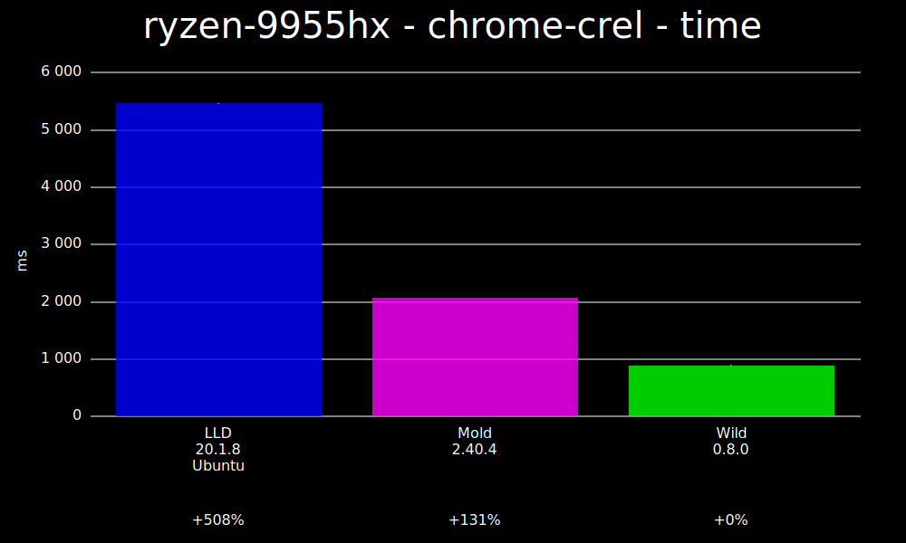
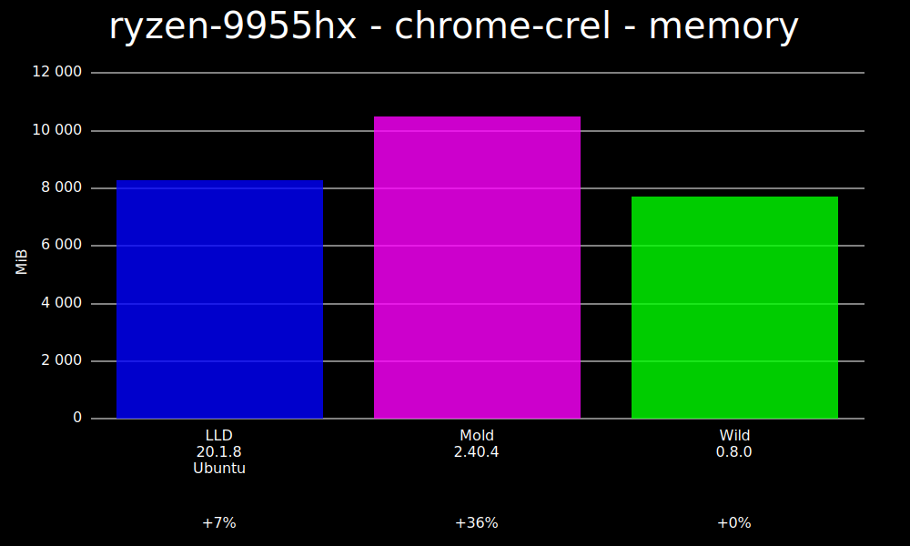
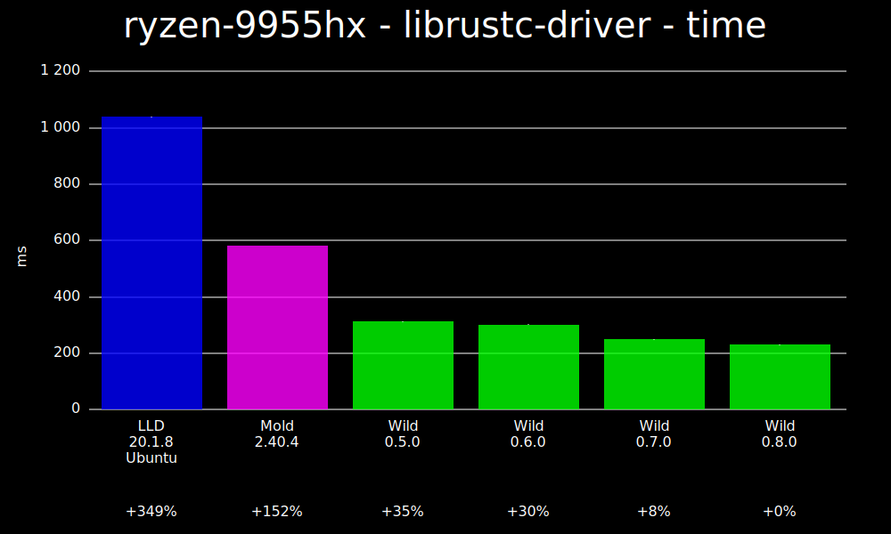
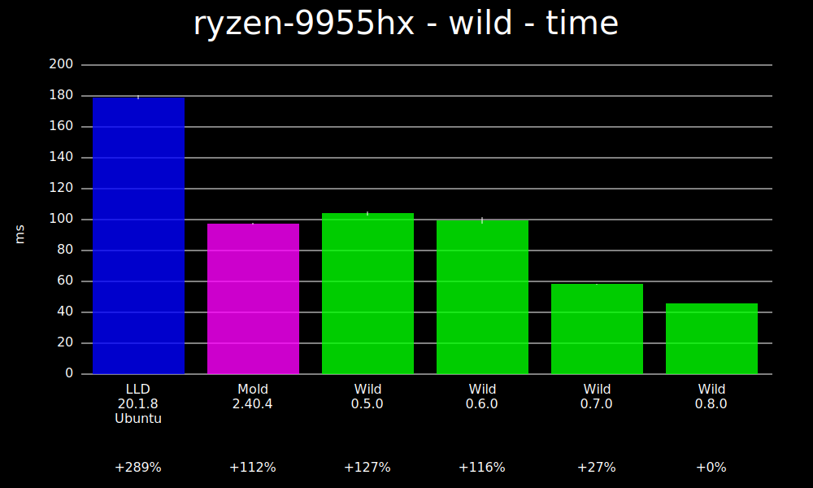

# Wild linker

Wild is a linker with the goal of being very fast for iterative development.

The plan is to eventually make it incremental, however that isn't yet implemented. It is however
already pretty fast even without incremental linking.

## Installation

### From GitHub releases

Download a tarball from the [releases page](https://github.com/davidlattimore/wild/releases). Unpack
it and copy the `wild` binary somewhere on your path.

### Cargo binstall

If you have [cargo-binstall](https://github.com/cargo-bins/cargo-binstall), you can install wild as
follows:

```sh
cargo binstall wild-linker
```

### Build latest release from crates.io

```sh
cargo install --locked wild-linker
```

### Build from git head

To build and install the latest, unreleased code:

```sh
cargo install --locked --bin wild --git https://github.com/davidlattimore/wild.git wild-linker
```

### Nix

To use a stable Wild from Nixpkgs:

```nix
let
 wildStdenv = pkgs.useWildLinker pkgs.stdenv;
in
pkgs.callPackage ./package { stdenv = wildStdenv; }  
```

to use the latest unstable git revision of wild, see [the nix documentation](./nix/nix.md)

## Using as your default linker

If you'd like to use Wild as your default linker for building Rust code, you can put the following
in `~/.cargo/config.toml`.

On Linux:
```toml
[target.x86_64-unknown-linux-gnu]
linker = "clang"
rustflags = ["-Clink-arg=--ld-path=wild"]
```

Alternatively, you can create symlink `ld.wild` pointing to `wild` and use:
```toml
[target.x86_64-unknown-linux-gnu]
linker = "clang"
rustflags = ["-Clink-arg=-fuse-ld=wild"]
```
The above steps also work for clang when building C/C++ code, just add the following to your LDFLAGS
after adding the `ld.wild` symlink:
```
export LDFLAGS="${LDFLAGS} -fuse-ld=wild"
```
GCC doesn't have [native](https://sourceware.org/pipermail/binutils/2025-November/145870.html) support for `wild` in any released version yet. You can make it force use it with the [-Bprefix](https://gcc.gnu.org/onlinedocs/gcc/Directory-Options.html#index-B) option. Create a symlink `ld` pointing to `wild` and pass the directory containing it to gcc. For example you can do the following:
```
ln -s /usr/bin/wild /tmp/ld
```
And when compiling C/C++ code pass the directory containing `ld` to your CFLAGS,CXXFLAGS and LDFLAGS:
```
export CFLAGS="${CFLAGS} -B/tmp"
export CXXFLAGS="${CXXFLAGS} -B/tmp"
export LDFLAGS="${LDFLAGS} -B/tmp"
```
Afterwards you can check if wild was used for linking with [readelf](#how-can-i-verify-that-wild-was-used-to-link-a-binary)

On Illumos:
```
[target.x86_64-unknown-illumos]
# Absolute path to clang - on OmniOS this is likely something like /opt/ooce/bin/clang.
linker = "/usr/bin/clang"

rustflags = [
    # Will silently delegate to GNU ld or Sun ld unless the absolute path to Wild is provided.
    "-Clink-arg=-fuse-ld=/absolute/path/to/wild"
]
```

## Using wild in CI

If you'd like to use Wild as your linker for Rust code in CI, see
[wild-action](https://github.com/davidlattimore/wild-action).

## Q&A

### Why another linker?

Mold is already very fast, however it doesn't do incremental linking and the author has stated that
they don't intend to. Wild doesn't do incremental linking yet, but that is the end-goal. By writing
Wild in Rust, it's hoped that the complexity of incremental linking will be achievable.

### What's working?

The following platforms / architectures are currently supported:

* x86-64 on Linux
* ARM64 on Linux
* RISC-V (riscv64gc) on Linux
* LoongArch64 on Linux (initial support)

The following is working with the caveat that there may be bugs:

* Output to statically linked, non-relocatable binaries
* Output to statically linked, position-independent binaries (static-PIE)
* Output to dynamically linked binaries
* Output to shared objects (.so files)
* Rust proc-macros, when linked with Wild work
* Most of the top downloaded crates on crates.io have been tested with Wild and pass their tests
* Debug info
* GNU jobserver support
* Very basic linker script support (section mapping, keeping sections, alignment, defining start /
  stop symbols).

### What isn't yet supported?

Lots of stuff. Here are some of the larger things that aren't yet done, roughly sorted by current
priority:

* Incremental linking
* Support for more architectures
* Support for a wider range of linker flags
* More complex linker scripts
* Mac support
* Windows support
* LTO

### How can I verify that Wild was used to link a binary?

Install `readelf` (available from binutils package), then run:

```sh
readelf --string-dump .comment my-executable
```

Look for a line like:

```
Linker: Wild version 0.1.0
```

You can probably also get away with `strings` (also available from binutils package):

```sh
strings my-executable | grep 'Linker:'
```

### Where did the name come from?

It's somewhat of a tradition for linkers to end with the letters "ld". e.g. "GNU ld, "gold", "lld",
"mold". Since the end-goal is for the linker to be incremental, an "I" is added. Let's say the "W"
stands for "Wild", since recursive acronyms are popular in open-source projects.

## Benchmarks

The goal of Wild is to eventually be very fast via incremental linking. However, we also want to be
as fast as we can be for non-incremental linking and for the initial link when incremental linking
is enabled.

All benchmarks are run with output to a tmpfs. See [BENCHMARKING.md](BENCHMARKING.md) for details on
running benchmarks.

We run benchmarks on a few different systems:

* [Ryzen 9 9955HX (16 core, 32 thread)](benchmarks/ryzen-9955hx.md)
* [2020 era Intel-based laptop with 4 cores and 8 threads](benchmarks/lemp9.md)
* [Raspberry Pi 5](benchmarks/raspberrypi.md)

Here's a few highlights.

### Ryzen 9955HX (16 core, 32 thread)

First, we link the Chrome web browser (or technically, Chromium).



Memory consumption when linking Chromium:



librustc-driver is the shared object where most of the code in the Rust compiler lives. This
benchmark shows the time to link it.



For something much smaller, this is the time to link Wild itself. This also shows a few different
Wild versions, so you can see how the link time has been tracking over releases.



### Raspberry Pi 5

Here's linking rust-analyzer on a Raspberry Pi 5.


## Linking Rust code

The following is a `cargo test` command-line that can be used to build and test a crate using Wild.
This has been run successfully on a few popular crates (e.g. ripgrep, serde, tokio, rand, bitflags).
It assumes that the "wild" binary is on your path. It also depends on the Clang compiler being
installed, since GCC doesn't allow using an arbitrary linker.

```sh
RUSTFLAGS="-Clinker=clang -Clink-args=--ld-path=wild" cargo test
```

Alternatively, with `ld.wild` symlink pointing at `wild`:
```sh
RUSTFLAGS="-Clinker=clang -Clink-args=-fuse-ld=wild" cargo test
```

## Contributing

For more information on contributing to `wild` see [CONTRIBUTING.md](CONTRIBUTING.md).

For a high-level overview of Wild's design, see [DESIGN.md](DESIGN.md).

## Chat server

We have a Zulip server for Wild-related chat. You can join
[here](https://wild.zulipchat.com/join/bbopdeg6howwjpaiyowngyde/).

## Further reading

Many of the posts on [David's blog](https://davidlattimore.github.io/) are about various aspects of
the Wild linker.

## Sponsorship

If you'd like to [sponsor this work](https://github.com/sponsors/davidlattimore), that would be very
much appreciated. The more sponsorship I get the longer I can continue to work on this project full
time.

## License

Licensed under either of [Apache License, Version 2.0](LICENSE-APACHE) or [MIT license](LICENSE-MIT)
at your option.

Unless you explicitly state otherwise, any contribution intentionally submitted for inclusion in
Wild by you, as defined in the Apache-2.0 license, shall be dual licensed as above, without any
additional terms or conditions.
