# Linker benchmarks on System76 Leur Pro 9

These benchmarks were run on a 2020 System 76 Lemur Pro 9 with 4 cores (8 threads). Small
differences on these benchmarks can probably be ignored. i.e. assume that all benchmarks here are
±2%.

## Time

### bevy-dylib - time
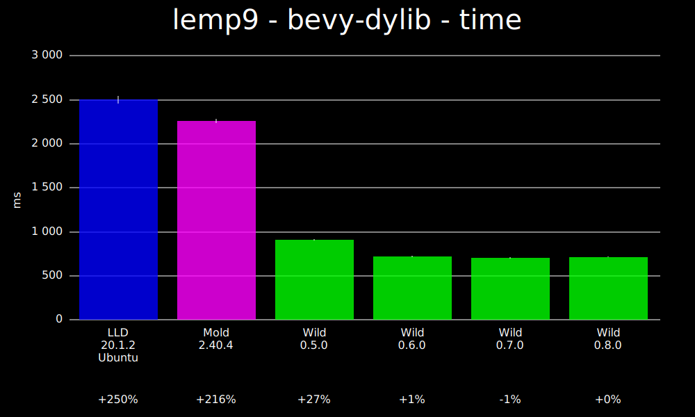

### chrome - time
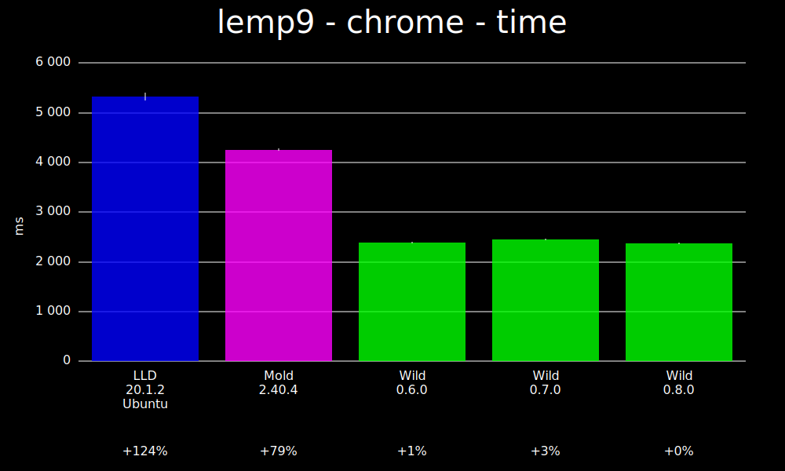

### librustc-driver - time

### ripgrep - time
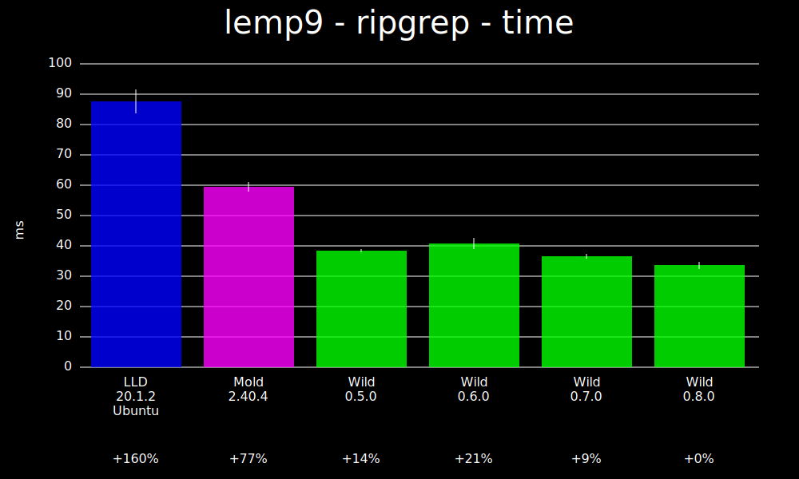

### rust-analyzer - time
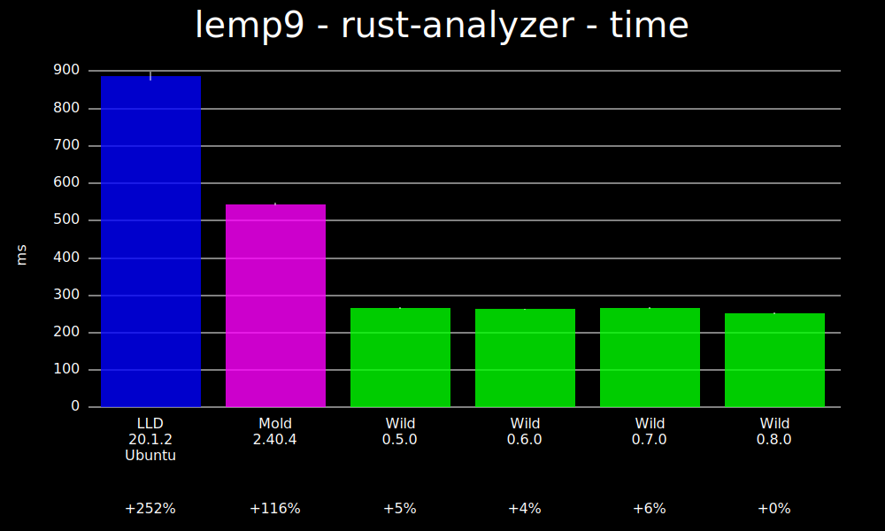

### wild - time
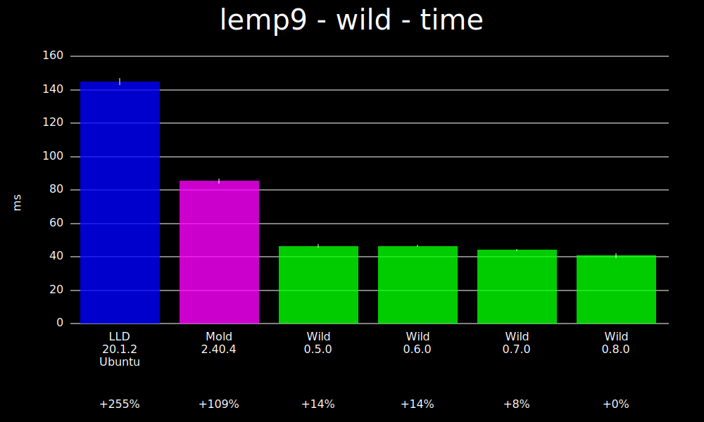

## Memory

### bevy-dylib - memory
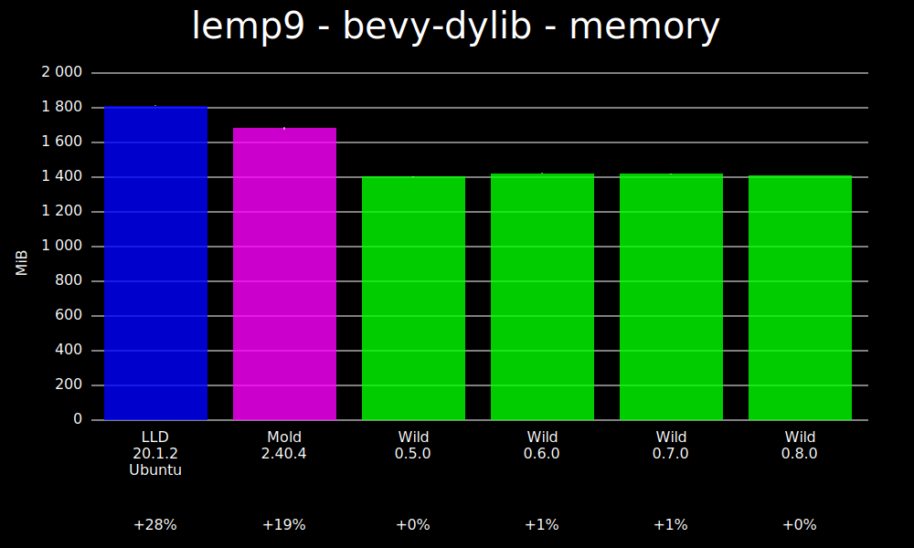

### chrome - memory
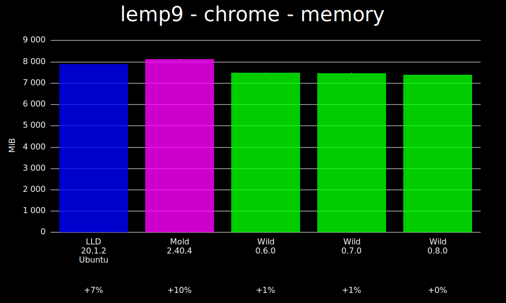

### librustc-driver - memory
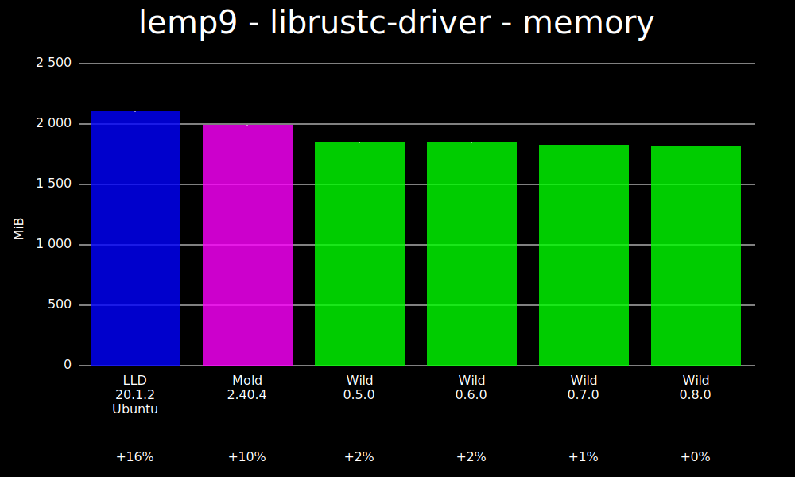

### ripgrep - memory
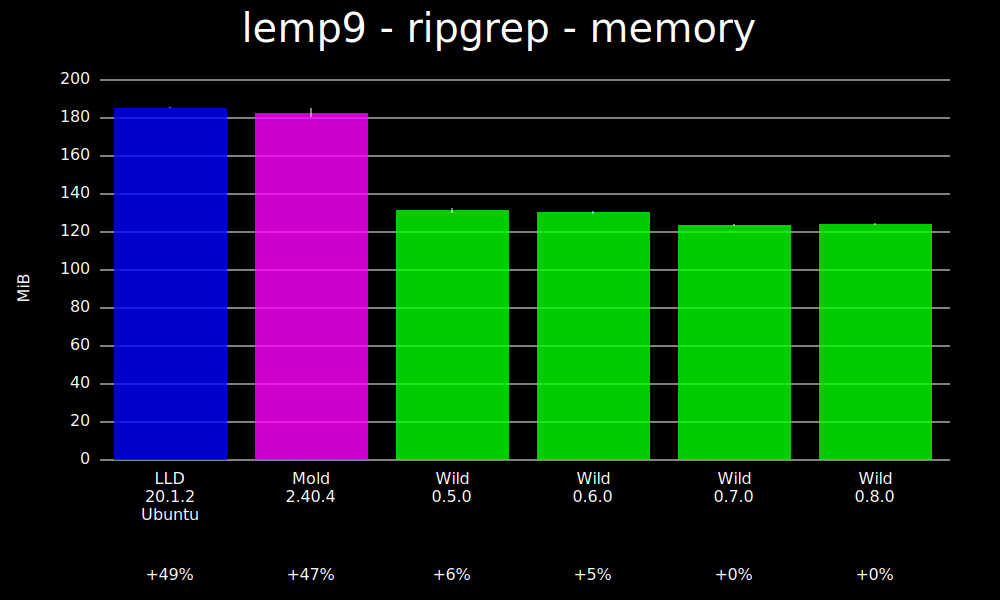

### rust-analyzer - memory
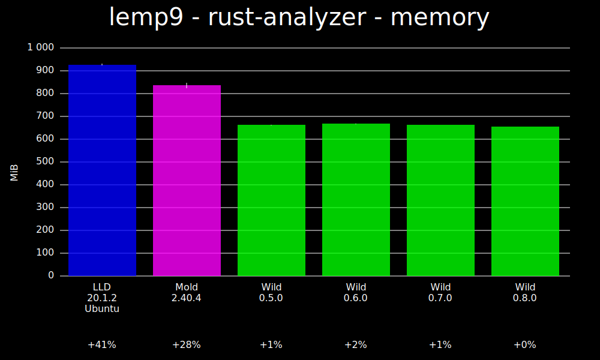

### wild - memory
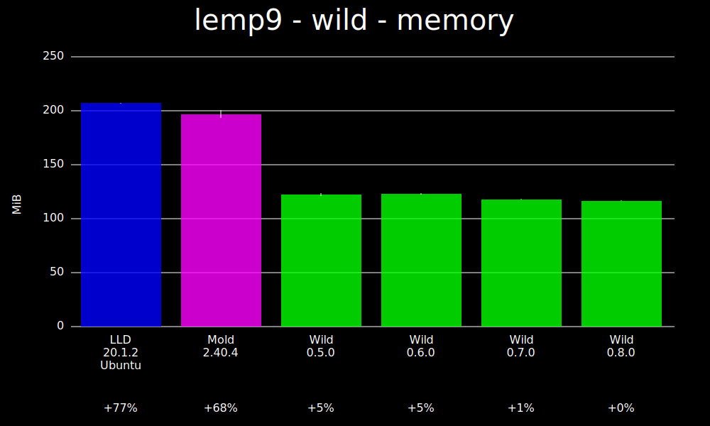

