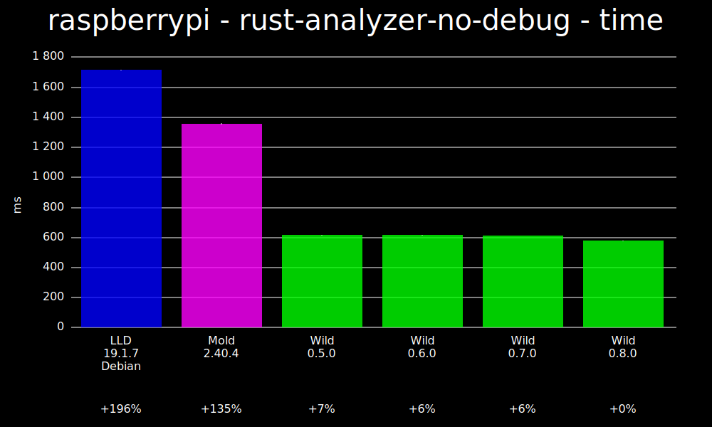
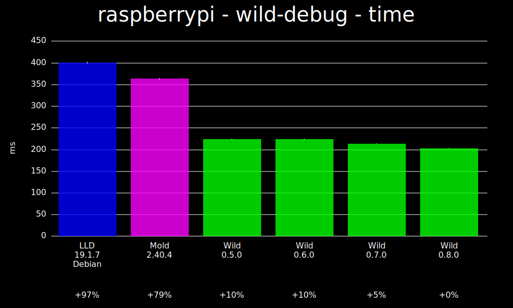
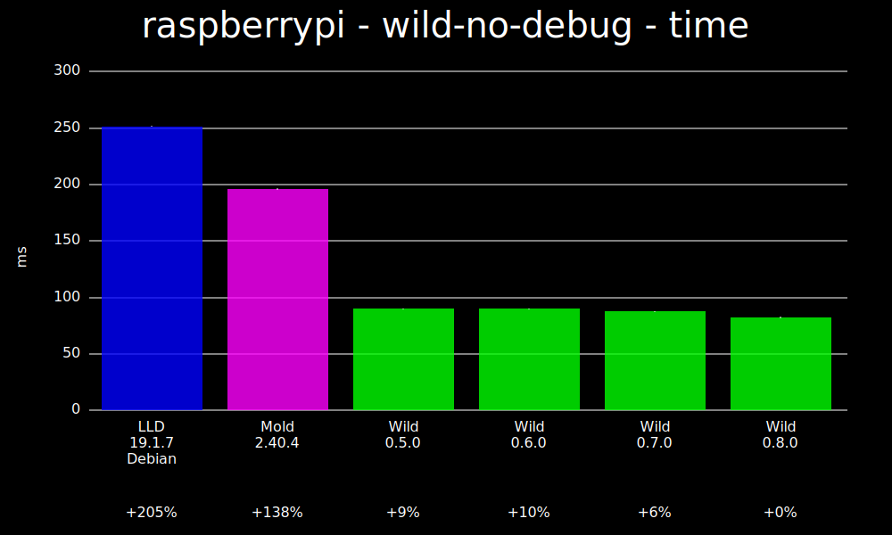
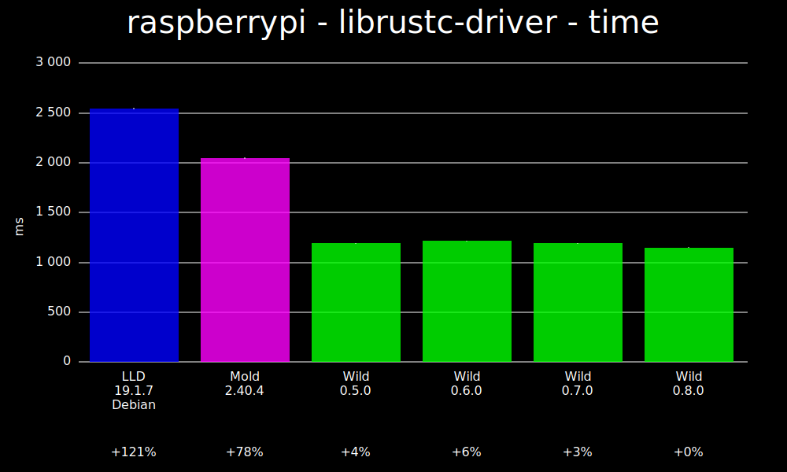
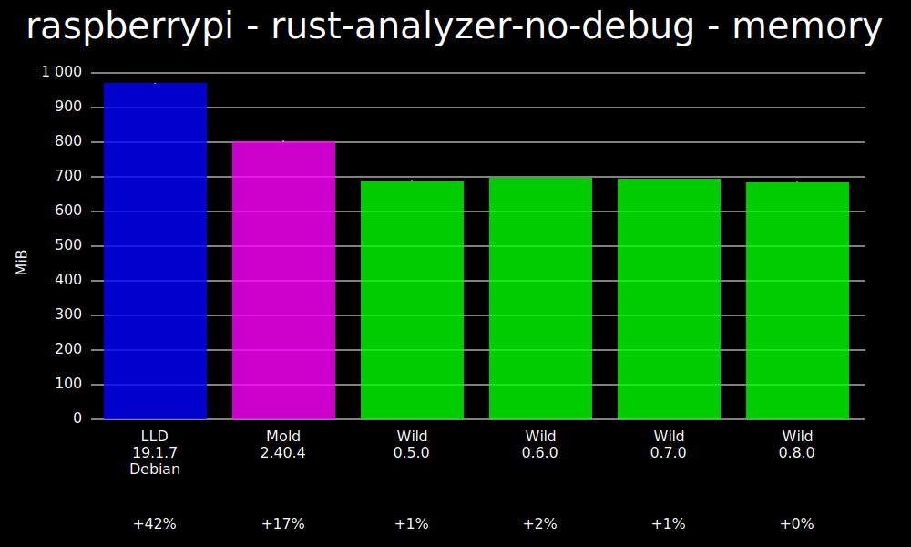
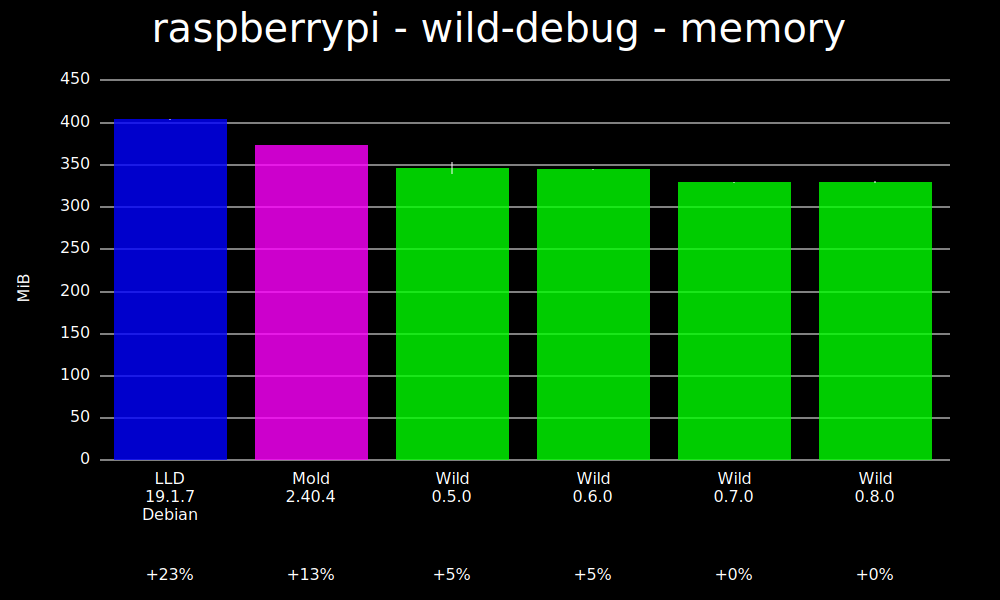
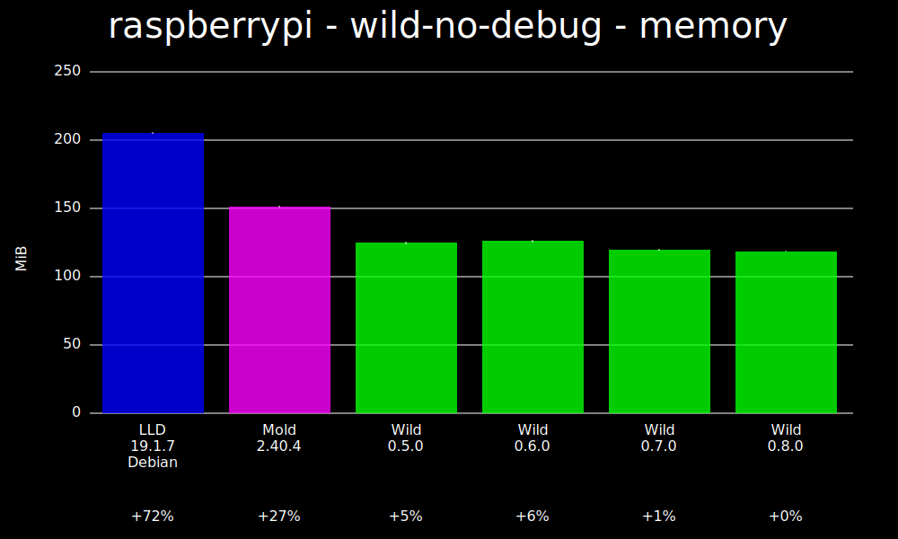
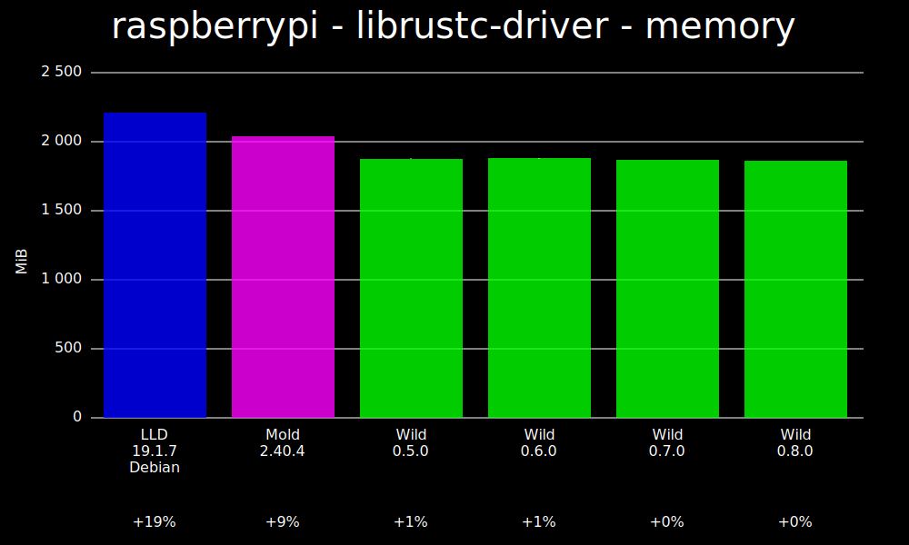

# Raspberry Pi 5 benchmarks

These benchmarks are for linking on a Raspberry Pi 5 with 8 GB of RAM.

## Time

### rust-analyzer-no-debug - time

### wild-debug - time

### wild-no-debug - time

### librustc-driver - time

## Memory

### rust-analyzer-no-debug - memory

### wild-debug - memory

### wild-no-debug - memory

### librustc-driver - memory

